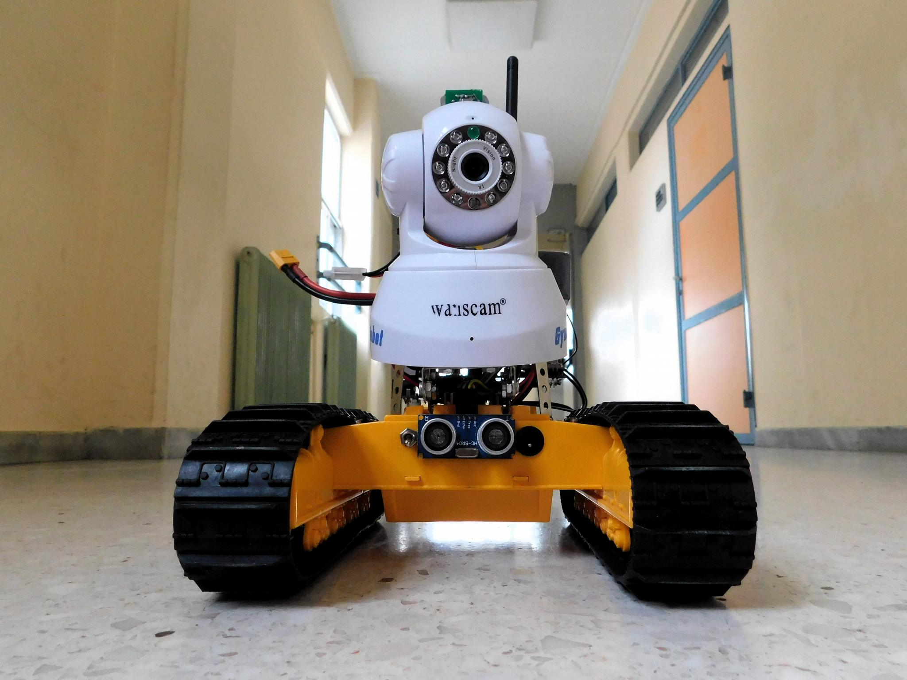
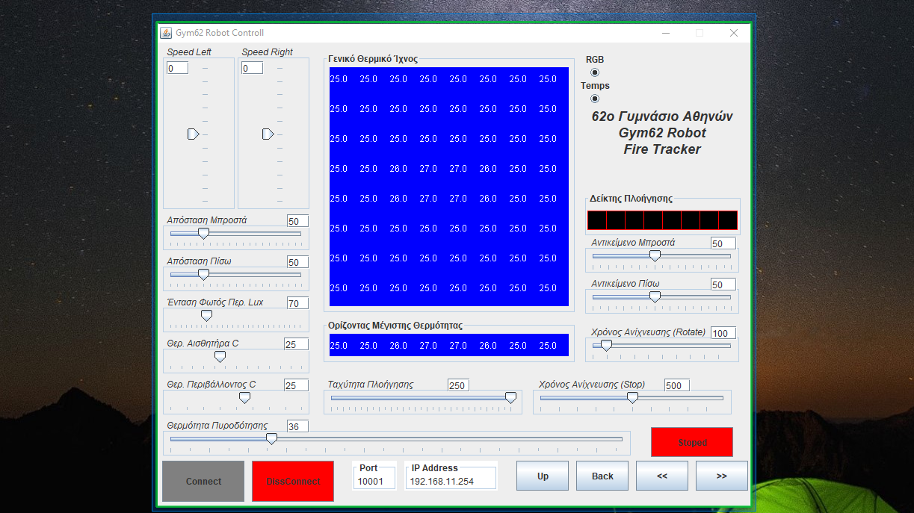
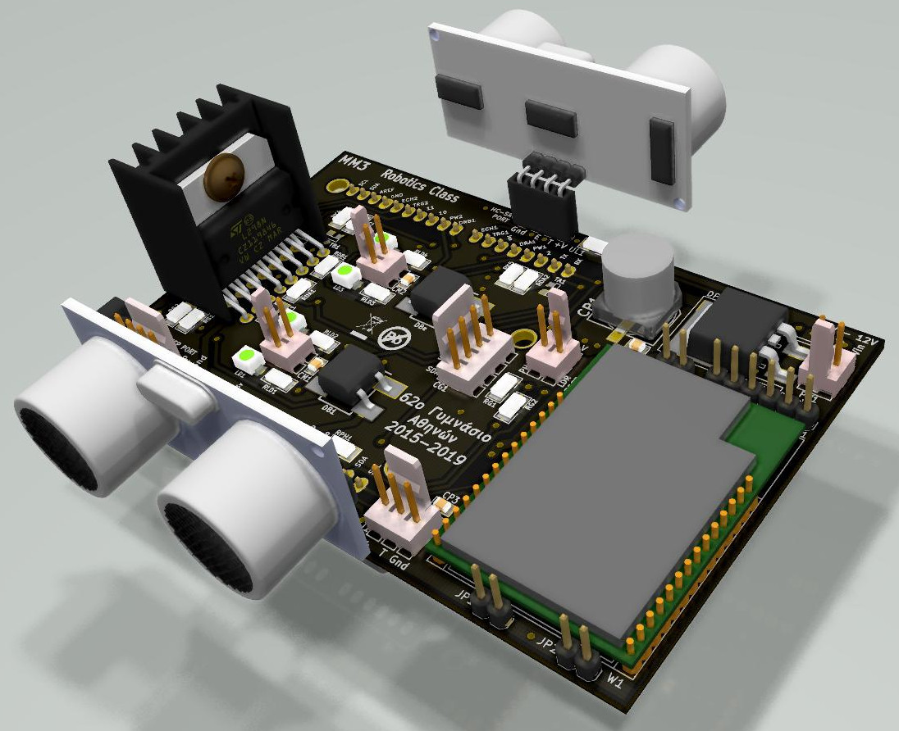

# Gym62-FireMan
## Αυτόνομο Όχημα Ανίχνευσης Θέσης Πυρκαϊάς

Η ομάδα ρομποτικής του 62ου Γυμνασίου Αθηνών, μελετά και κατασκευάζει ένα  αυτοκινούμενο όχημα, το οποίο έχει ως σκοπό να επιτηρεί και να προστατεύει ένα δάσος από πυρκαϊά, και παράλληλα να μεταδίδει τα δεδομένα διαμέσου WiFi σημείου πρόσβασης που διαθέτει ενσωματωμένο.

Το Gym62-FireMan βασίστηκε σε ένα ερπυστριοφόρο σκάφος εκσκαφέα, το οποίο τροποποιήθηκε κατάλληλα για τις ανάγκες του έργου, ελάχιστης αξίας, και σε έναν ειδικό αισθητήρα παράταξης υπερύθρων ακτίνων. 

## Περιγραφή πλοήγησης

 Το σύστημα βασίζεται σε ένα αισθητήρα παράταξης υπέρυθρων ακτίνων.
 
 
 
Ο αισθητήρας παράταξης είναι δομημένος σε ένα πίνακα 8*8 στοιχείων, δίνοντας 64 ανεξάρτητα σημεία μέτρησης της θερμότητας.
 Χωρίζοντας τον αισθητήρα σε 8 ζώνες ορίζοντα, ανιχνεύεται ο ορίζοντας στον οποίο εμφανίζεται η μέγιστη θερμοκρασία. Με βάση τον επιλεγμένο ορίζοντα, το όχημα μεταβάλει την ταχύτητα των ερπυστριών συνεχώς, αναλογικά σε σχέση πάντα με την θέση της μέγιστης θερμοκρασίας στον επιλεγμένο ορίζοντα.
 Αυτή ή συνεχώς μεταβαλλόμενη ταχύτητα των ερπυστριών οδηγεί με μεγάλη ακρίβεια το όχημα στην θέση της πυρκαϊάς.   
 Πιο συγκεκριμένα το όχημα θα περιστρέφεται συνεχώς γύρω από τον εαυτό του μετρώντας τα θερμικά φορτία του πεδίου ορατότητας. Εάν κατά την περιστροφή, μετρηθεί θερμικό φορτίο μεγαλύτερο από το προκαθορισμένο, τότε θα σταματάει και θα κινείται προς αυτό, διορθώνοντάς συνεχώς την πορεία του φροντίζοντας να την διατηρεί πάντα σταθερή και ευθεία μπροστά, επικοινωνώντας ταυτόχρονα με κέντρο ελέγχου μεταδίδοντας σήματα σχετικά με τις λειτουργίες του και να αποδέχεται ρυθμίσεις πλοήγησης.

## Λογισμικό Κέντρου Ελέγχου.
Το Gym62RCNT είναι μια εφαρμογή τηλεμετρίας για τον έλεγχο και της ρυθμίσεις του οχήματος.
Αναπτύσσεται σε περιβάλλον NetBeans 8.6 Java JDK 1.8.
Για να τρέξετε την εφαρμογή χωρίς την χρήση Του  NetBeans. Εγκαταστήστε το  java run time environment στο συστημά σας και τρέξτε το αρχείο  Gym62RCNT.jar

## Κύκλωμα Gym62-MM3
Πρόκειται για ένα ηλεκτρονικό κύκλωμα επέκτασης οποιασδήποτε συμβατού Arduino πού λειτουργεί ως βάση σύνδεσης όλων των περιφερειακών συστημάτων τηλεμετρίας και τηλεκήνησης.
Για την ανάπτυξη του χρησιμοποιήθηκε το Ανοιχτό λογισμικό  KiCad IDE.

